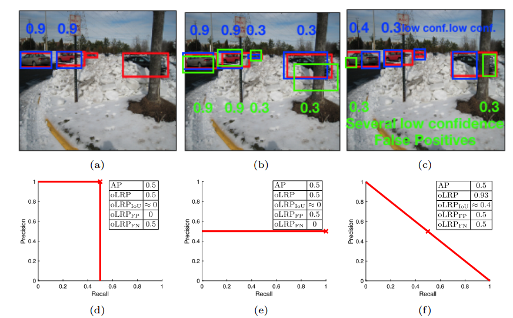

# LRP (Localization Recall Precision) Performance Metric & Thresholder for Object Detection

This repository contains Python and MATLAB implementations of the [LRP](arxiv link) object detection performance metric. The repository supports both PASCAL-VOC and MS COCO datasets. Please cite the following paper if you use LRP. 

Kemal Oksuz, Baris Can Cam, Emre Akbas, Sinan Kalkan, "Localization Recall Precision (LRP): A New Performance Metric for Object Detection," In: European Conference on Computer Vision (2018). 

In a nutshell, LRP is an alternative to average precision (AP), which is the area under the recall-precision curve and is currently the dominant performance measure used in object detection. 



In the figure above, three different object detection results are shown (for an image from ILSVRC 2015 Dataset) with very different RP (recall-precision) curves. Note that they all have same same AP. AP is not able to identify the difference between these curves. In (a), (b) and (c), red, blue and green colors denote ground-truth bounding boxes, true positive detections and false positive detections respectively. The numerical values in the images denote confidence scores. (d), (e) and (f) show RP curves, AP and oLRP results for the corresponding detections in (a),(b),(c). Red crosses denote Optimal LRP points.


# What does LRP provide?

1. The Performance Metric for the Object Detection Problem: Average precision (AP), the area under the recall-precision (RP) curve, is the standard performance measure for object detection. Despite its wide acceptance, it has a number of shortcomings, the most important of which are (i) the inability to distinguish very different RP curves, and (ii) the lack of directly measuring bounding box localization accuracy. ''Localization Recall Precision (LRP) Error'' is a new metric which is specifically designed for object detection. LRP Error is composed of three components related to localization, false negative (FN) rate and false positive (FP) rate. Based on LRP, we introduce the ''Optimal LRP'', the minimum achievable LRP error representing the best achievable configuration of the detector in terms of recall-precision and the tightness of the boxes. In our experiments, we show that, for state-of-the-art object (SOTA) detectors, Optimal LRP provides richer and more discriminative information than AP.

2. LRP As a Thresholder: In contrast to AP, which considers precisions over the entire recall domain, Optimal LRP determines the ''best'' confidence score threshold for a class, which balances the trade-off between localization and recall-precision. We demonstrate that the best confidence score thresholds vary significantly among classes and detectors. Moreover, we present LRP results of a simple online video object detector which uses a SOTA still image object detector and show that the class-specific optimized thresholds increase the accuracy against the common approach of using a general threshold for all classes.

# Getting Started:

## MS COCO dataset
The official MS COCO toolkit is modified for LRP Metric evaluation. So you will find a similar folder organization with the official toolkit. Currently, you can find the 2017 train/val annotations under the annotations folder of the cocoLRPapi-master and a Faster R-CNN result file under the results folder of cocoLRPapi-master.

## Pascal VOC dataset
(Coming Soon)

## What the implementation provides
In any case, besides the paramaters of the evaluation, this implementation provides 4 different set of outputs:

1. LRP values and LRP components for each class and each confidence score threshold
2. oLRP values and oLRP components for each class 
3. moLPR value and moLRP components for the detector
4. Optimal Class Specific Thresholds for each class

# Evaluation on MS COCO:
First clone/download the "cocoLRPapi-master" folder:
  ## Using Python:
  1. Execute the command "make" from terminal in the PythonAPI folder.
  2. For the demo, just run the evalDemoLRP.py script to test whether your computer satisfies the requirements.
  3. In order to test with your own ground truth and detection results, set the following 4 parameters in the evalDemoLRP.m script: the ground truth file path in line 8, the detection result file path in line 11, the tau parameter, the minimum IoU to validate a detection in line 14 and finally DetailedLRPResultNeeded parameter to 0 or 1. If it is DetailedLRPResultNeeded is 1, then you will see all of the 4 different set of outputs in the terminal. If it is 0, then you will see the results for 2-4 (oLRP, moLRP values and Optimal Class Specific Thresholds).
  ## Using MATLAB:
  1. For the demo, just run the evalDemoLRP.m script to test whether your computer satisfies the requirements.
  2. In order to test with your own ground truth and detection results, set the following 3 parameters in the evalDemoLRP.m script: the ground truth file path in line 7, the detection result file path in line 10 and the tau parameter, the minimum IoU to validate a detection in line 21. 

Note that MS COCO uses json files as the standard detection&annotation format. See http://cocodataset.org for further information.
# Evaluation on PASCAL-VOC:
Evaluation steps for PASCAL-VOC.
 ## Using Python:

## Preperation:
  Clone this repository into your local.

  ```
    git clone https://github.com/cancam/LRP
  ```

##  Dataset:
    
   This repository follows the offical structure of PASCAL-VOC development kit.
   1. Download training, validation (optional) and test data and VOC-devkit.
    
    ```
    wget http://host.robots.ox.ac.uk/pascal/VOC/voc2007/VOCtrainval_06-Nov-2007.tar
    wget http://host.robots.ox.ac.uk/pascal/VOC/voc2007/VOCtest_06-Nov-2007.tar
    wget http://host.robots.ox.ac.uk/pascal/VOC/voc2007/VOCdevkit_08-Jun-2007.tar
    ```
    
   Extract all content.
    
    ```
    tar xvf VOCtrainval_06-Nov-2007.tar
    tar xvf VOCtest_06-Nov-2007.tar
    tar xvf VOCdevkit_08-Jun-2007.tar
    ```
   
   3. Directory should have the following basis structure.
   
    ```
    $VOCdevkit/                           # development kit
    $VOCdevkit/VOCcode/                   # VOC utility code
    $VOCdevkit/VOC2007                    # image sets, annotations, etc.
    # ... and several other directories ...
    ```
    
   4. Either you can put the entire pascal-voc evaluation kit under the pascal-voc-lrp directory or a better approach is that you can create symbolic link to "VOCdevkit" under pascal-voc-lrp directory with the following command.
    
   
   ```
   ln -s $VOCdevkit VOCdevkit
   ```
    
## Execution: 
  pascal-voc-lrp evaluation kit can be executed with two ways. Either you can provide a pickle file in which all the detections are included or you can provide offical pascal-voc class-wise text files. The pickle file should have the same format with the one provided as an example (see: ${pascal-voc-lrp}/results/det/detections_voc_test_base.pkl). Evaluation results will be provided by a text file that contains class-wise and overall results in ${pascal-voc-lrp}/results/eval/lrp_results.txt by default.

## Example Execution:
The toolkit can be tested using the example pickle file that is located under "/results/det".
```
python pascal_voc --use_pickle --boxes_path ${lrp_eval}/results/det/detections_voc_test_base.pkl
```
Or the framework can evaluate the detections using standart form of PASCAL-VOC text file detections.
```
python pascal_voc
```

  Arguments:
  
    ```
    --use_pickle: Flag to evaluate model detections directly from saved pickle file.*
    
    --boxes_path: Path to previously mentioned pickle file.
    
    --tau: IoU threshold to evaluate detection.
    
    --save_results: To specify the path of the text file that contains class-wise and overall results under lrp and ap metrics.
    
    --set: Which set to perform evaluation on. (train, val, test)
    
    --year: Which year to perform evaluation on. (i.e.: VOC2007, VOC2012)
    
    --comp: Whether to use competition mode or not.
    
    --devkit_path: To specify a different devkit path.
    ```

 ## Using MATLAB:
 MATLAB steps...(Coming Soon)

# Requirements:
Python 2.7 or MATLAB (Our implementation is based on MATLAB R2017b)


## Citation
If you find this code useful for your research, please consider citing our paper:
```
@Inproceedings{LRP-ECCV18,
  Title          = {Localization Recall Precision (LRP): A New Performance Metric for Object Detection},
  Author         = {Oksuz, Kemal and Cam, Baris and Akbas, Emre and Kalkan, Sinan},
  Booktitle      = {European Conference on Computer Vision (ECCV)},
  Year           = {2018}
}
```
